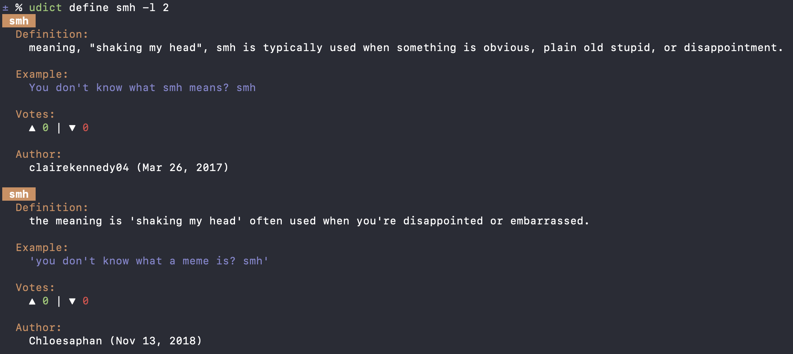

# udict

A command-line tool to fetch definitions from Urban Dictionary directly from your terminal.

`udict` is a simple and efficient tool for getting definitions from Urban Dictionary, with styled output for easy
reading.

## Demo



## Installation

### Prerequisites

- Go 1.25 or later is required.

### Using `go install`

You can install `udict` directly using `go install`:

```sh
go install github.com/ty-cs/udict@latest
```

### Building from Source

To build the project, clone the repository and run the following command from the root directory:

```sh
go build
```

## Usage

After building, you can run the application using:

```sh
udict [command] [flags]
```

Alternatively, you can run it without building using:

```sh
go run main.go [command] [flags]
```

### Commands

#### `define`

Fetches definitions for a given word from Urban Dictionary.

**Flags:**

- `-l`, `--limit`: The number of definitions to display (up to 5).

**Example:**

```sh
udict define --limit 3 "gemini"
```

#### `random`

Fetches definitions for a random word from Urban Dictionary.

**Example:**

```sh
udict random
```

#### `version`

Displays the version of the `udict` tool.

**Example:**

```sh
udict version
```

## Features

- **Urban Dictionary Definitions**: The `define` command fetches definitions for a specified word.
- **Random Words**: The `random` command provides definitions for a random word.
- **Styled Output**: The output is styled using `lipgloss` for better readability.
- **Customizable Definition Limit**: The `define` command allows you to limit the number of definitions displayed.

## Dependencies

- [Cobra](https://github.com/spf13/cobra): A popular library for creating powerful and modern CLI applications in Go.
- [Lipgloss](https://github.com/charmbracelet/lipgloss): A library for styling terminal output.

## Contributing

Contributions are welcome! Please feel free to submit a pull request or open an issue.

## License

This project is licensed under the MIT License - see the [LICENSE](LICENSE) file for details.
